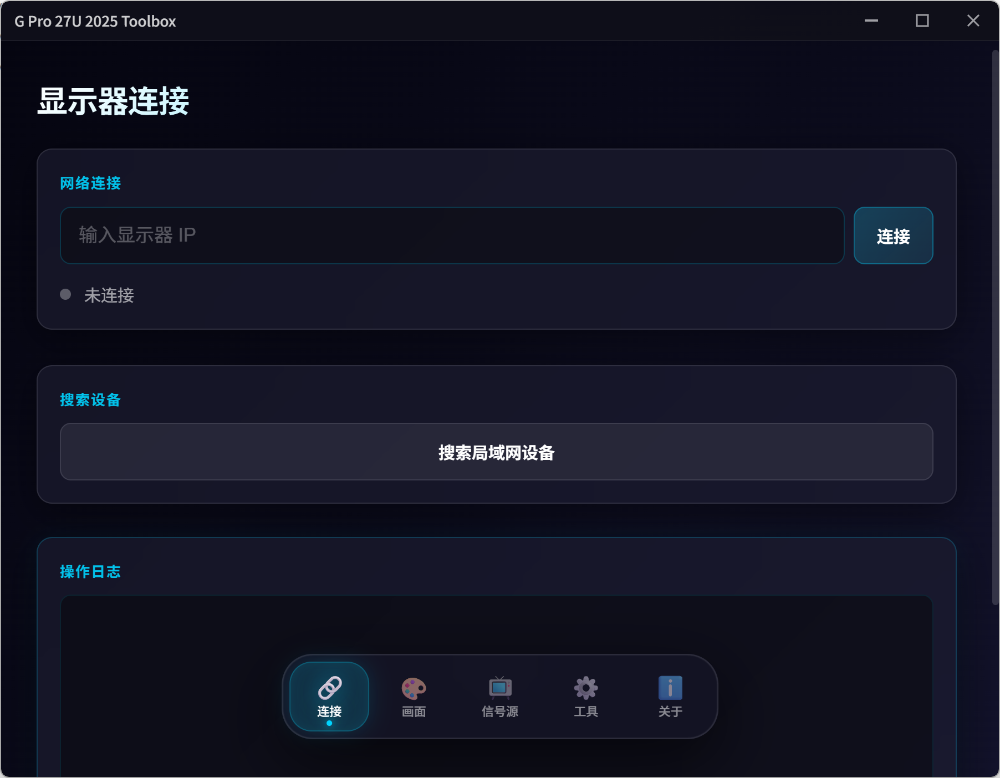
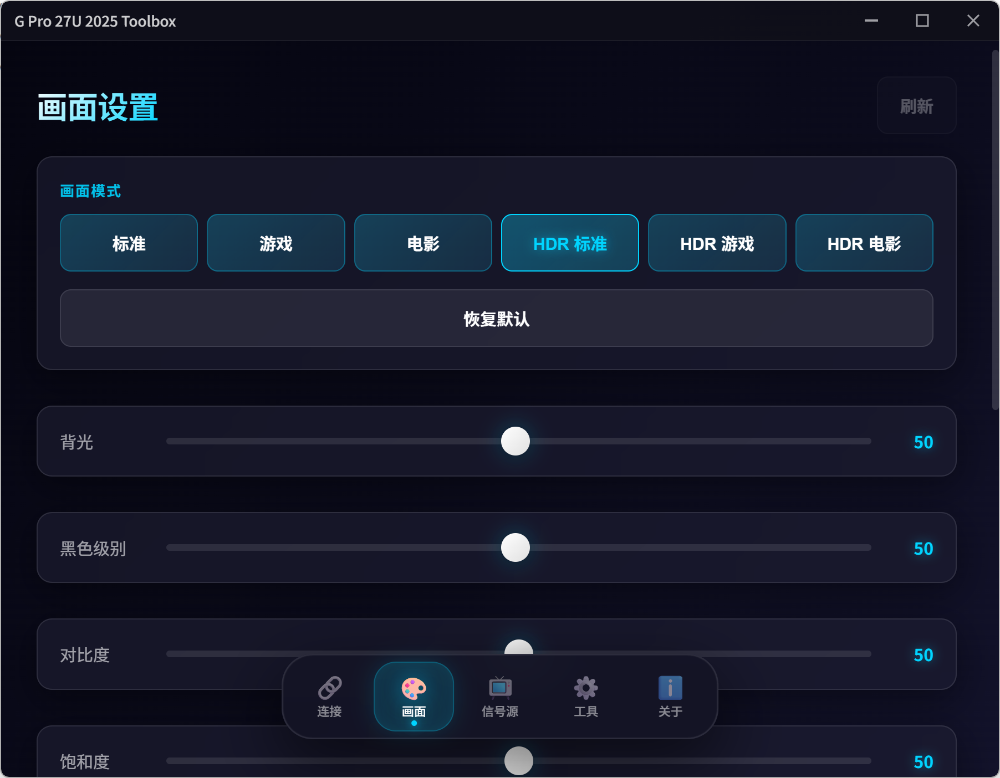

# G Pro 27U 2025 Toolbox

 Redmi G Pro 27U 2025款 显示器 ADB 控制工具

基于 Tauri Web 桌面版，通过 ADB 无线连接显示器内置 Android 系统，实现对各项显示参数的精确控制。

测试机器系统版本号：HyperOS 3.0.109.0


 原项目 YiHooong/Mimonitor_Toolbox: https://github.com/YiHooong/Mimonitor_Toolbox


## 软件截图




## 实现原理

通过无线 ADB 连接到显示器内置的 Android 系统，利用 `settings` 命令和 MTK 平台 JNI 接口（`MtkDirectTool.jar`）直接读写硬件寄存器，实现对显示器各项参数的精确控制。

### 通信架构

```
浏览器 (Vue3 Web UI)
    ↓ Tauri invoke
Rust 后端
    ↓ 执行命令
adb.exe (ADB Wireless)
    ↓
显示器 Android 系统 (port 5555)
    ↓
settings get/put ──► 读写 Android Global Settings
    (picture_mode, picture_backlight, picture_contrast, ...)
MtkDirectTool.jar ──► MTK JNI 直写硬件寄存器
    (背光 g_disp__disp_back_light)
    (色温 g_video__clr_temp)
    (精密控光 g_video__vid_local_dimming)
    (色域 g_video__vid_gamut_mapping_mode)
    (320Hz g_fusion_picture__hdmi_edid_version)
    (FreeSync g_video__freesync_switch)
```

### JNI 调用方式

通过 `service call TvService` 调用系统服务，以 `app_process` 执行 jar 包中的 Java 类：

```bash
# 读取寄存器
service call TvService 3 s16 "sh -c eval\${IFS}CLASSPATH=/data/data/mitv.service/cache/MtkDirectTool.jar\${IFS}/system/bin/app_process\${IFS}/data/data/mitv.service/cache\${IFS}MtkDirectTool\${IFS}get\${IFS}g_disp__disp_back_light"

# 写入寄存器
service call TvService 3 s16 "sh -c eval\${IFS}CLASSPATH=...\${IFS}MtkDirectTool\${IFS}set\${IFS}g_disp__disp_back_light\${IFS}50\${IFS}3"
```

读取结果通过 `logcat` 获取。

## 功能

- 无线 ADB 连接
- 画面设置：模式 / 背光 / 黑色级别 / 对比度 / 饱和度 / 色调 / 锐度 / 色温 / 精密控光 / 动态清晰度 / 响应时间 / 色域
- 信号源切换（HDMI 1 / HDMI 2 / DP）
- 工具：4K UI 模式 / 重启显示器
- 操作日志
- 关于页面

## 项目结构

```
web/
├── src/                      # Vue3 前端
│   ├── views/               # 页面
│   │   ├── Home.vue        # 连接页面
│   │   ├── Picture.vue     # 画面设置
│   │   ├── Source.vue      # 信号源
│   │   ├── Tools.vue       # 工具
│   │   └── About.vue       # 关于
│   ├── composables/        # ADB 状态管理
│   ├── api/                # Tauri invoke 调用
│   └── styles/             # 样式
├── src-tauri/              # Rust 后端
│   ├── src/main.rs         # ADB 命令封装
│   └── bin/                # 内嵌 adb 二进制
├── adb.exe                 # ADB 主程序
├── AdbWinApi.dll
└── AdbWinUsbApi.dll
```

## 开发

### 环境要求

- Node.js 18+
- Rust / Cargo
- Tauri CLI 2.x

### 开发模式

```bash
cd web
npm install
npm run tauri:dev
```

### 构建

```bash
cd web
npm install
npm run tauri:build
```

打包产物位于 `web/src-tauri/target/release/bundle/`：
- Windows: `nsis/` 目录（安装版）
- macOS: `dmg/` 目录
- Linux: `deb/` 目录

## 感谢

基于 YiHooong/Mimonitor_Toolbox 的实现原理
