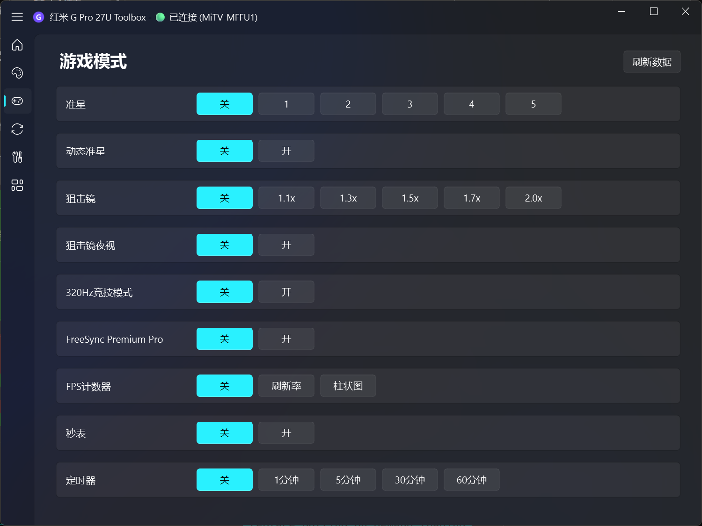

# Mimonitor Toolbox

Redmi G Pro 27U 2025款 显示器 ADB 控制工具

专为 2025 款 Redmi G Pro 27U 适配开发，通过 ADB 直连显示器内置 Android 系统，实现对各项显示参数的精确控制。

测试机器系统版本号：HyperOS 3.0.109.0  


原作者/项目 YiHooong/Mimonitor_Toolbox


## 软件截图




## 实现原理

通过无线 ADB 连接到显示器内置的 Android 系统，利用 `settings` 命令和 MTK 平台 JNI 接口（`MtkDirectTool.jar`）直接读写硬件寄存器，实现对显示器各项参数的精确控制。

### 通信架构

```
PC (MonitorToolbox.exe)
  │
  ├─ ADB Wireless ──► 显示器 Android 系统 (port 5555)
  │
  ├─ settings get/put ──► 读写 Android Global Settings
  │   (picture_mode, picture_backlight, picture_contrast, ...)
  │
  └─ MtkDirectTool.jar ──► MTK JNI 直写硬件寄存器
      (背光 g_disp__disp_back_light)
      (色温 g_video__clr_temp)
      (色域 g_video__vid_gamut_mapping_mode)
      (精密控光 g_video__vid_local_dimming)
      (320Hz g_fusion_picture__hdmi_edid_version)
      (FreeSync g_video__freesync_switch)
      (恢复默认 g_fusion_picture__pic_reset_def_bypicmode)
```

### JNI 调用方式

通过 `service call TvService` 调用系统服务，以 `app_process` 执行 jar 包中的 Java 类：

```bash
# 读取寄存器
service call TvService 3 s16 "sh -c eval\${IFS}CLASSPATH=/data/data/mitv.service/cache/MtkDirectTool.jar\${IFS}/system/bin/app_process\${IFS}/data/data/mitv.service/cache\${IFS}MtkDirectTool\${IFS}get\${IFS}g_disp__disp_back_light"

# 写入寄存器
service call TvService 3 s16 "sh -c eval\${IFS}CLASSPATH=...\${IFS}MtkDirectTool\${IFS}set\${IFS}g_disp__disp_back_light\${IFS}50\${IFS}3"
```

读取结果通过 `logcat` 获取。

### 数据加载策略

采用按需加载，不持续轮询：

1. **首次进入页面** — 读取该页面所有 settings key + JNI 寄存器，显示 loading 遮罩
2. **再次进入** — 直接使用缓存数据，不重新读取
3. **手动刷新** — 点击"刷新数据"按钮强制重新读取
4. **模式切换** — 自动刷新当前页面数据

### Jar 自动部署

首次连接时自动检测并补齐 `MtkDirectTool.jar`：

1. 检查设备 `/sdcard/` 是否已有 jar
2. 没有则从本地 push 到 `/sdcard/`
3. 从 `/sdcard/` 复制到 `/data/data/mitv.service/cache/`

打包后 jar 嵌入 exe 中（PyInstaller `--add-binary`）。

## 功能

- 无线 ADB 连接，内网设备自动扫描
- 画面设置：模式 / 背光 / 黑色级别 / 对比度 / 饱和度 / 色调 / 锐度 / 色温 / 精密控光 / 动态清晰度 / 响应时间 / 色域
- 游戏模式：准星 / 动态准星 / 狙击镜 / 夜视 / 320Hz / FreeSync / FPS 计数器 / 秒表 / 定时器
- 信号源切换（HDMI 1/2 / DP / USBC）
- 虚拟遥控器
- 全局快捷键（Windows）+ OSD 悬浮通知
- 开机自启动最小化
- 4K UI 模式（3840×2160 / DPI 640，需重启显示器）
- 操作日志记录与导出

## 打包

### Web 桌面版（Tauri）

```bash
cd web
npm install
npm run tauri:build
```

打包产物：
- Windows：`web/src-tauri/target/release/bundle/nsis/`（安装版）
- macOS：`web/src-tauri/target/release/bundle/dmg/`
- Portable：直接使用 `web/src-tauri/target/release/monitor-toolbox.exe`（adb 自动内嵌）

### Python 版（PyInstaller）

```bash
pip install pyinstaller pyqt6 qfluentwidgets
pyinstaller --onefile --windowed --name "MonitorToolbox" --icon=icon.ico \
  --hidden-import qfluentwidgets \
  --add-binary "adb.exe;." \
  --add-binary "AdbWinApi.dll;." \
  --add-binary "AdbWinUsbApi.dll;." \
  --add-binary "MtkDirectTool.jar;." \
  monitor_controller.py
```

## 依赖

### Web 桌面版
- Node.js 18+
- Rust / Cargo
- Tauri CLI

### Python 版
- Python 3.10+
- PyQt6
- qfluentwidgets
- ADB（打包进 exe，无需额外安装）

## 感谢认可！🙌
